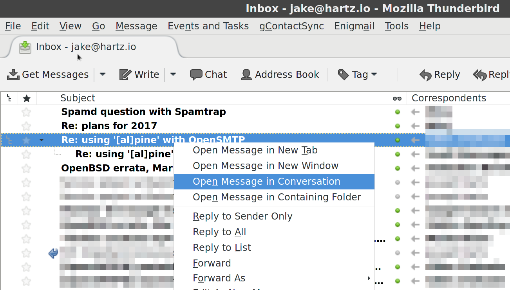

# Open In Conversation

Thunderbird add-on to make the default message list action "Open Message in Conversation"

## What's New

- **0.9** (November 8, 2016): Initial release
- **1.0.1** (October 20, 2019): Updated from `install.rdf` to `manifest.json` for compatibility with Thunderbird 68

## How it Works

First, be sure you have message threading enabled (*View* > *Sort by* > *Threaded*). Then, right-click on a thread. Notice the option "Open Message in Conversation":

Basically, this add-on makes that the default action when you press "Enter" or double-click a message.

This works best when you don't have the "multi-pane" layout (i.e. you open messages in a new tab instead of viewing them in a pane).

The window that opens contains not only the messages in the thread that are in your inbox, but also ones in other folders (so you can see sent messages in there too).

## Installation

Go to *Tools* > *Add-ons*, search for "Open In Conversation", and click "Add to Thunderbird".

For more info, go to the [Mozilla Add-ons page](https://addons.thunderbird.net/addon/open-in-conversation/) for Open In Conversation.

For Thunderbird to be able to identify conversations, the setting *Enable Global Search and Indexer* needs to be enabled in *Preferences* > *Advanced* > *General*.

## License

This project is licensed under the Mozilla Public License version 2. For more, see the [LICENSE](LICENSE) file.
